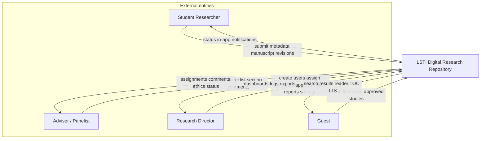
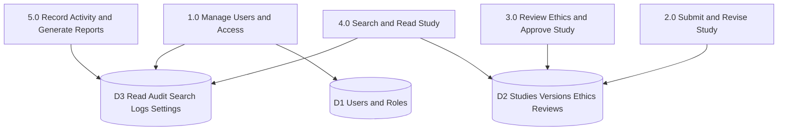
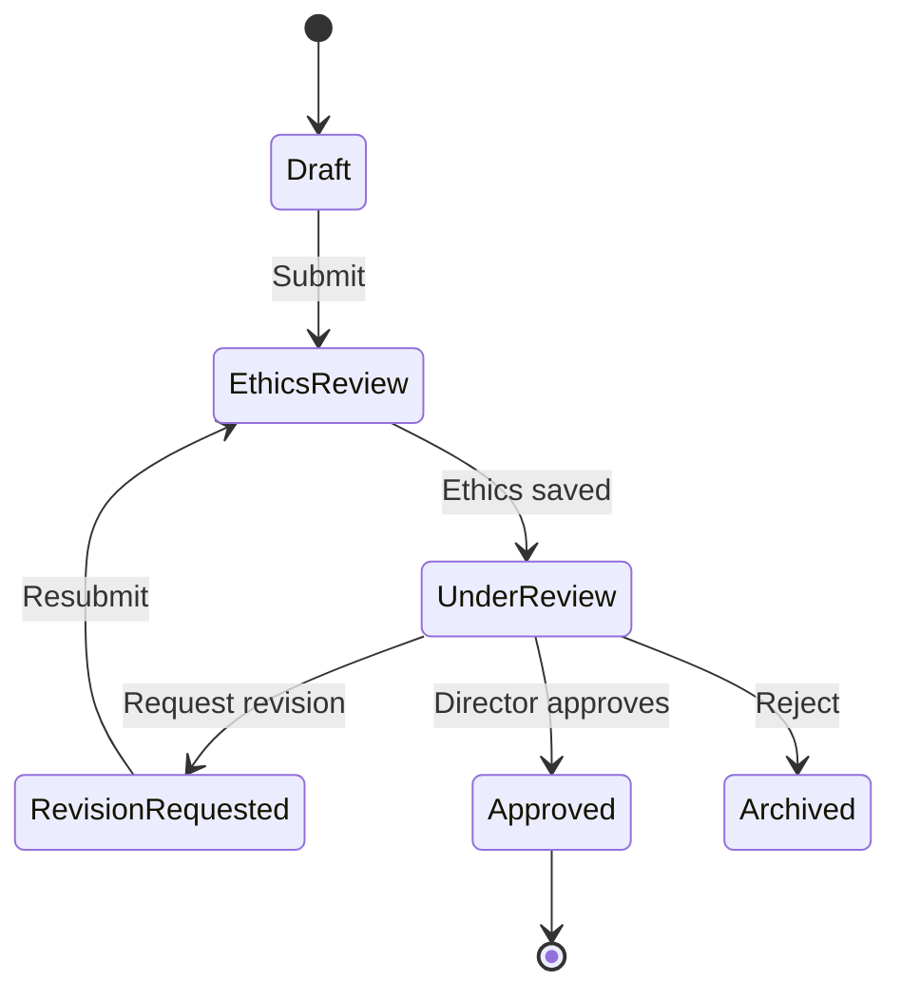

# Context diagram and Level 0 DFD

## Context diagram (research function focus)

```mermaid
flowchart TB
  subgraph external [External entities]
    STU[Student Researcher]
    ADV[Adviser / Panelist]
    RD[Research Director]
    GST[Guest]
  end

  SYS[LSTI Digital Research Repository]

  STU -->|submit metadata manuscript revisions| SYS
  ADV -->|ethics checklist section comments| SYS
  RD -->|create users assign reviewers approve reject reports settings| SYS
  GST -->|search filter read approved studies| SYS

  SYS -->|status in-app notifications| STU
  SYS -->|assignments comments ethics status| ADV
  SYS -->|dashboards logs exports| RD
  SYS -->|search results reader TOC TTS| GST
```

## Level 0 DFD

```mermaid
flowchart TB
  P1[1.0 Manage Users and Access]
  P2[2.0 Submit and Revise Study]
  P3[3.0 Review Ethics and Approve Study]
  P4[4.0 Search and Read Study]
  P5[5.0 Record Activity and Generate Reports]

  D1[(D1 Users and Roles)]
  D2[(D2 Studies Versions Ethics Reviews)]
  D3[(D3 Read Audit Search Logs Settings)]

  P1 --> D1
  P1 --> D3
  P2 --> D2
  P3 --> D2
  P4 --> D2
  P4 --> D3
  P5 --> D3
```

## Research process flow

```mermaid
stateDiagram-v2
  [*] --> Draft
  Draft --> EthicsReview: Submit
  EthicsReview --> UnderReview: Ethics saved
  UnderReview --> RevisionRequested: Request revision
  RevisionRequested --> EthicsReview: Resubmit
  UnderReview --> Approved: Director approves
  UnderReview --> Archived: Reject
  Approved --> [*]
```
