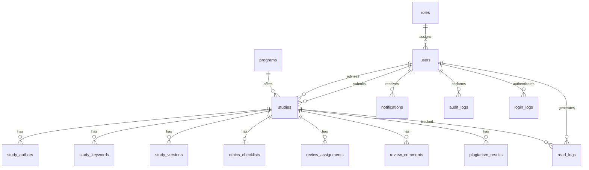

# Entity relationship diagram

```mermaid
erDiagram
  roles ||--o{ users : assigns
  users ||--o{ studies : submits
  users ||--o{ studies : advises
  programs ||--o{ studies : offers
  studies ||--o{ study_authors : has
  studies ||--o{ study_keywords : has
  studies ||--o{ study_versions : has
  studies ||--o| ethics_checklists : has
  studies ||--o{ review_assignments : has
  studies ||--o{ review_comments : has
  studies ||--o{ plagiarism_results : has
  users ||--o{ notifications : receives
  users ||--o{ read_logs : generates
  studies ||--o{ read_logs : tracked
  users ||--o{ audit_logs : performs
  users ||--o{ login_logs : authenticates
```
